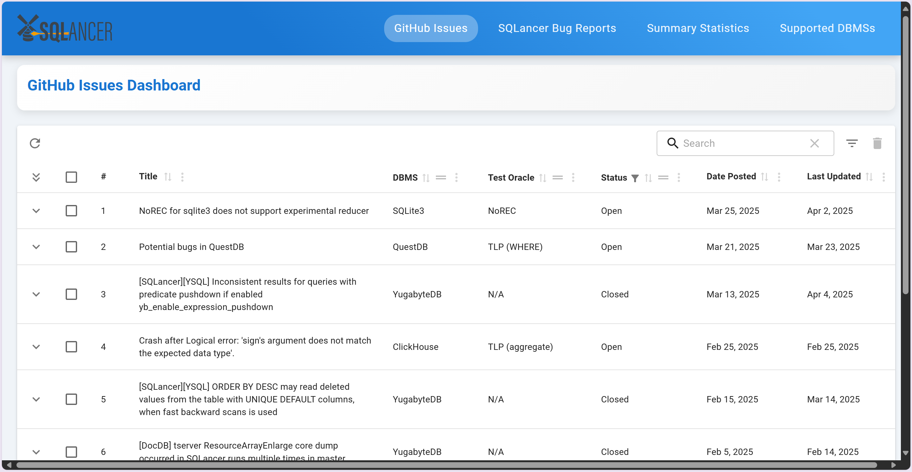
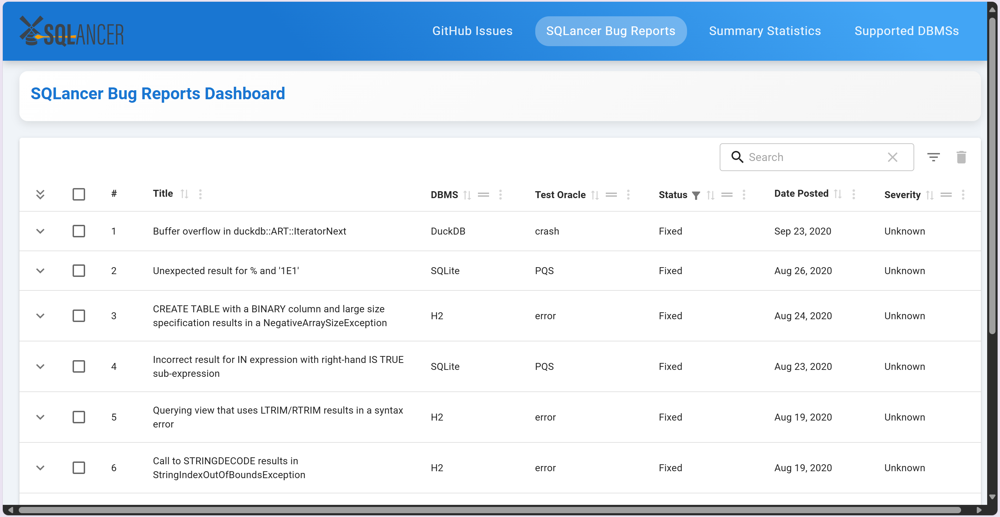
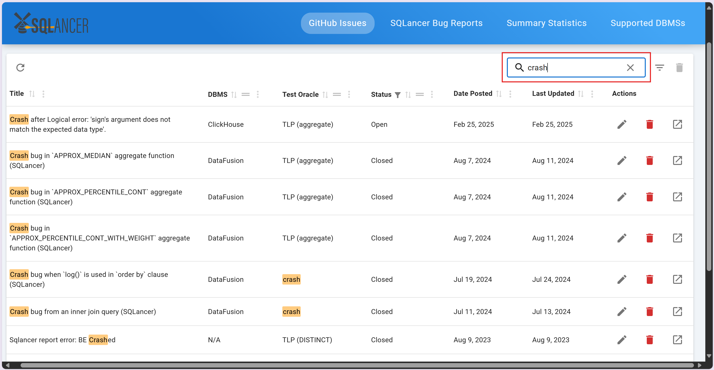
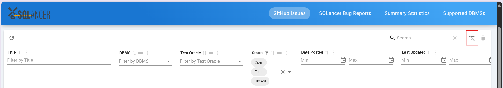
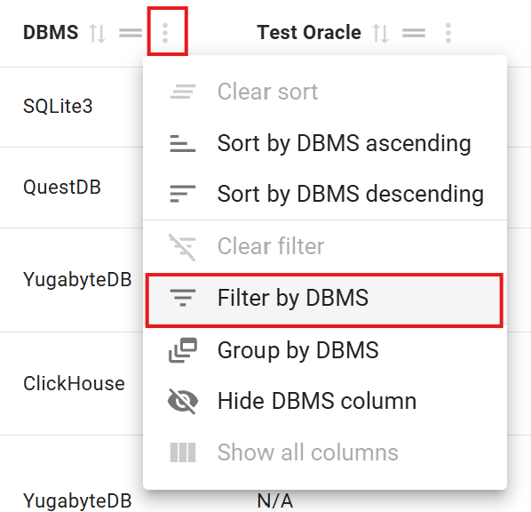
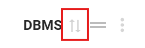
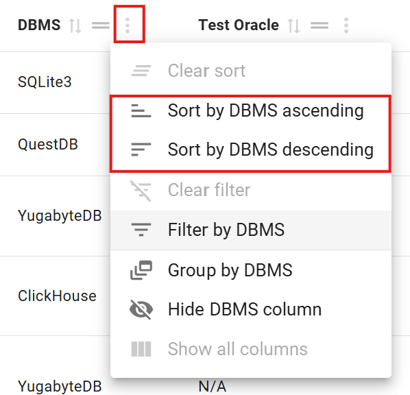
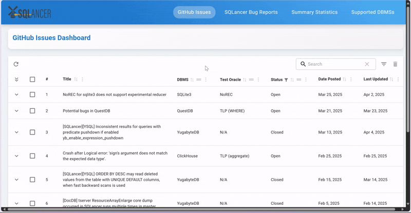

# Bug Analysis Website User Guide

This website is designed to **compile bugs found by SQLancer** reported across multiple sources (e.g., GitHub issues) and **visualize the aggregated data in charts and tables** to gain useful insights.

If you are a **database system developer** or **tester**, you can use this website to track which bugs have been found or fixed and identify common bugs to better prioritize debugging or testing efforts.

If you are a **database user**, you can explore trends in bug frequency, fix rates, and overall reliability across different database systems.

Refer to the [Quick Start](#quick-start) section to get started and the [Features](#features) section to explore what the website can do.

## Table of Contents

1. [Quick Start](#quick-start)
2. [Features](#features)
   - [Viewing bug reports](#viewing-bug-reports)
   - [Searching and filtering bug reports](#searching-and-filtering-bug-reports)
   - [Sorting and grouping bug reports](#sorting-and-grouping-bug-reports)
   - [Editing bug reports](#editing-bug-reports)
   - [Deleting bug reports](#deleting-bug-reports)
   - [Refreshing list of GitHub issues](#refreshing-list-of-github-issues)
   - [Generating charts for selected GitHub issues](#generating-charts-for-selected-github-issues)
   - [Viewing summary statistics](#viewing-summary-statistics)
   - [Viewing supported DBMSs](#viewing-supported-dbmss)
3. [FAQ](#faq)

## Quick Start

1. Ensure you have [Node.js](https://nodejs.org/en/download) version 18 or later installed.
2. Download and unzip the source code archive file from [here](https://github.com/NUS-CS3213-AY2425S2/bug-analysis-project-group-13/releases/latest).
3. Download the `.env` file from [Google Drive](https://drive.google.com/file/d/1h-SdR_qSfQC5Fzs8qkBQ3JCDehea29-l/view?usp=sharing) and save it in the `backend/` directory.

   > When downloading the `.env` file, make sure the filename includes the leading `.`

4. Open two command terminals and `cd` to the project directory.

   On the first terminal, run the following commands:

   ```
   cd frontend
   npm install
   npm run dev
   ```

   On the second terminal, run the following commands:

   ```
   cd backend
   npm install
   node server.js
   ```
5. The website can be accessed at http://localhost:5173/.

## Features

### Viewing bug reports

The **GitHub Issues** page consists GitHub Issues that are related to [SQLancer Bugs](https://github.com/search?q=sqlancer&type=issues&s=created&o=desc).



<br/>

The **SQLancer Bug Report** page consists bugs that are listed in [SQLancer Bugs Repository](https://github.com/sqlancer/bugs).



### Searching and filtering bug reports

You can use the **search bar** to look for bugs in the table. The search is case-insensitive and returns matches in the title, DBMS, test oracle, or status fields.



<br/>

Click on the filter toggle button to show or hide filters.



<br/>

Alternatively, you can also click on column action to filter by certain column.



### Sorting and grouping bug reports

The Title, DBMS, Test Oracle, Status, Date Posted, Last Updated, and Severity columns can be sorted in ascending or descending order. By default, the list is sorted in descending order based on the Date Posted column.



<br/>

Alternatively, you can also click on column action to sort by certain column.



<br/>

The DBMS, Test Oracle, Status and Severity columns can be grouped by dragging the move button into the drop region.



### Editing bug reports

You can edit the **DBMS**, **Test Oracle**, and **Status** fields of a GitHub issue by clicking the **edit icon** in the Actions column of the corresponding row. This makes the entire row editable, allowing you to make changes and save them in place.

For **SQLancer bug reports**, only the **Status** and **Severity** fields are editable.

<!-- Insert screenshot here -->

### Deleting bug reports

You can delete a bug report by clicking the **delete icon** in the Actions column of the corresponding row. This opens a confirmation dialog asking you to confirm the deletion.

<!-- Insert screenshot here -->

You can delete multiple bug reports at once by selecting the desired rows using the checkboxes and clicking the **delete icon** in the toolbar. This opens a confirmation dialog asking you to confirm the deletion.

<!-- Insert screenshot here -->

> [!CAUTION]
> Deleting bug reports is permanent and cannot be undone. Make sure you intend to delete them before confirming.

### Refreshing list of GitHub issues

You can update the list of GitHub issues by clicking the **refresh icon** in the toolbar. New issues will be added to the top of the table, while existing issues will be updated in place.

<!-- Insert screenshot here -->

### Generating charts for selected GitHub issues

You can generate summary charts for selected GitHub issues by selecting the desired rows using the checkboxes and clicking the **chart** icon in the toolbar. This opens a chart dialog where you can configure the chart settings.

<!-- Insert screenshot here -->

<!-- Insert screenshot here -->

The chart dialog allows you to:

1. **Choose a field** to group the issues by:
   - DBMS
   - Oracle
   - Status
   - Date Posted
2. **Specify a start date and end date** to filter the issues by **Date Posted**.
3. **Select up to 5 DBMSs** to display in the chart when grouping issues by **Date Posted**.

> [!NOTE]
> Issues where the DBMS is "N/A" and Status is "Not a bug" are excluded from the charts.

### Viewing summary statistics

The **Summary Statistics** page provides an overview of bug reports by status for each DBMS across GitHub issues and SQLancer bug reports.

You can switch between three view modes to view the statistics: **table**, **bar chart**, and **line chart**.

<!-- Insert screenshot here -->

<!-- Insert screenshot here -->

<!-- Insert screenshot here -->

The line chart shows the number of bug reports for each DBMS per month and allows you to:

- Filter by a date range
- Select specific DBMSs using the chips above the chart

### Viewing supported DBMSs

The **Suppported DBMSs** page shows all database management systems currently supported by SQLancer.

<!-- Insert screenshot here -->

**Supported DBMSs:**

- Citus
- ClickHouse
- CnosDB
- CockroachDB
- Databend
- DataFusion
- Doris
- DuckDB
- H2
- HSQLDB
- MariaDB
- Materialize
- MySQL
- OceanBase
- PostgreSQL
- Presto
- QuestDB
- SQLite3
- TiDB
- YugabyteDB

## FAQ

**Q**: Why is there no refresh feature for SQLancer bug reports?<br>
**A**: SQLancer bug reports are compiled manually in the official [SQLancer bugs repository](https://github.com/sqlancer/bugs/blob/master/bugs.json), which is not frequently updated. As such, there is no refresh feature for SQLancer bug reports in the current version of the website.
