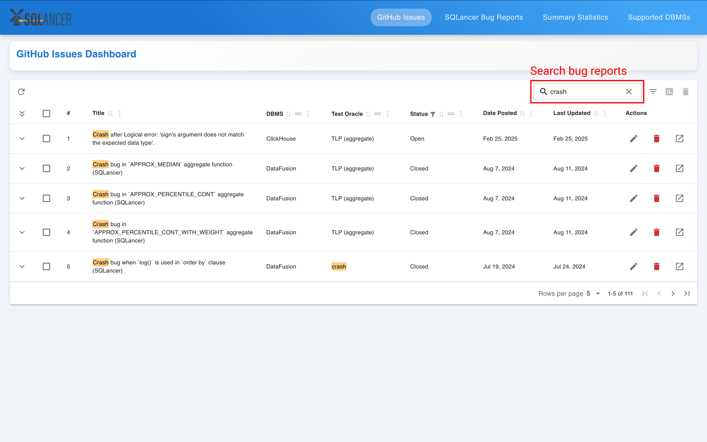
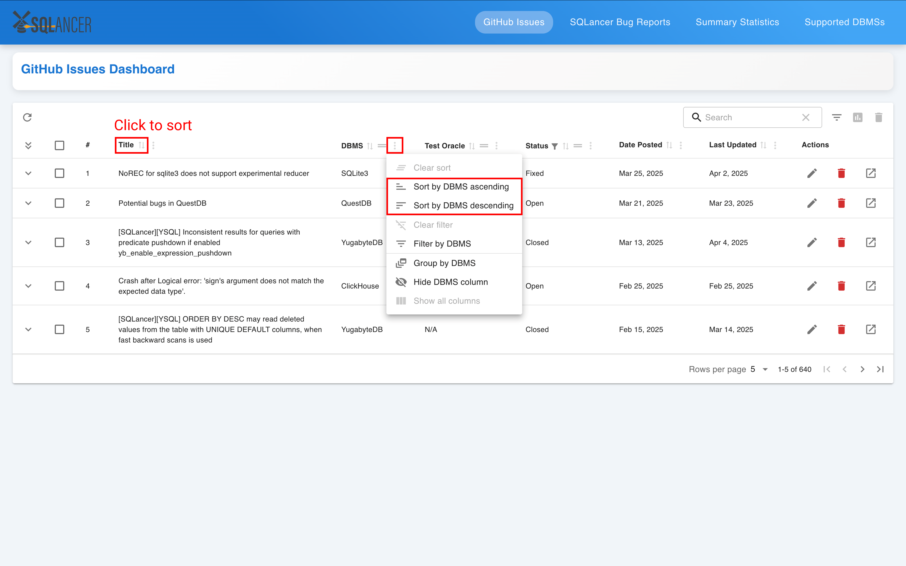
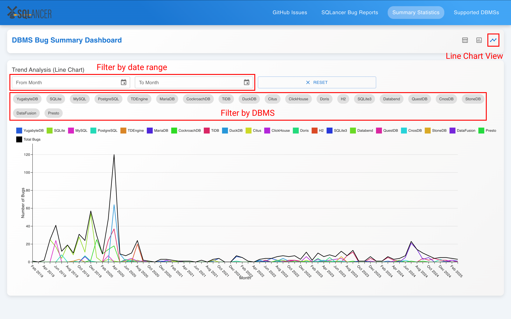

# Bug Analysis Website User Guide

This website is designed to **compile bugs found by SQLancer** reported across multiple sources such as GitHub issues and **visualize the aggregated data in charts and tables** to gain useful insights.

If you are a **database system developer** or **tester**, you can use this website to track which bugs have been found or fixed and identify common bugs to better prioritize debugging or testing efforts.

If you are a **database user**, you can explore trends in bug frequency, rate of bug fixes, and overall reliability across different database systems.

Refer to the [Quick Start](#quick-start) section to get started and the [Features](#features) section to explore what the website can do.

## Table of Contents

1. [Quick Start](#quick-start)
2. [Features](#features)
   - [Viewing bug reports](#viewing-bug-reports)
   - [Searching and filtering bug reports](#searching-and-filtering-bug-reports)
   - [Sorting and grouping bug reports](#sorting-and-grouping-bug-reports)
   - [Editing bug reports](#editing-bug-reports)
   - [Deleting bug reports](#deleting-bug-reports)
   - [Refreshing GitHub issues](#refreshing-github-issues)
   - [Generating charts for selected GitHub issues](#generating-charts-for-selected-github-issues)
   - [Viewing summary statistics](#viewing-summary-statistics)
   - [Viewing supported DBMSs](#viewing-supported-dbmss)
3. [FAQ](#faq)

## Quick Start

1. Ensure you have [Node.js](https://nodejs.org/en/download) version 18 or later installed.
2. Download and unzip the source code archive file from [here](https://github.com/NUS-CS3213-AY2425S2/bug-analysis-project-group-13/releases/latest).
3. Download the `.env` file from [Google Drive](https://drive.google.com/file/d/1h-SdR_qSfQC5Fzs8qkBQ3JCDehea29-l/view?usp=sharing) and save it in the `backend/` directory.

   > When downloading the `.env` file, make sure the filename includes the leading `.`

4. Open two command terminals and `cd` to the project directory.

   On the first terminal, run the following commands:

   ```
   cd frontend
   npm install
   npm run dev
   ```

   On the second terminal, run the following commands:

   ```
   cd backend
   npm install
   node server.js
   ```
5. The website can be accessed at http://localhost:5173/.

## Features

### Viewing bug reports

You can view bug reports on two separate pages: **GitHub Issues** and **SQLancer Bug Reports**.

Each page displays a table of bug reports sorted by **Date Posted** in descending order. By default, bug reports labeled as "Not a bug" are hidden from the table.


1. **Pagination**: Use the buttons on the bottom toolbar to navigate between pages. Use the dropdown menu to adjust the number of rows displayed per page.
2. **Detail panel**: Click the expand button on a row to view its description. Click the expand all button on the column header to expand or collapse all rows at once.
3. **View issue on GitHub**: Click the open in new icon on a row to view the original issue on GitHub in a new tab.

The **SQLancer Bug Reports** page shares the same layout but excludes links to the original source. The bug reports are retrieved from the official [SQLancer bugs repository](https://github.com/sqlancer/bugs/blob/master/bugs.json).


### Searching and filtering bug reports

You can search for bug reports containing specific keywords using the **search box** in the top toolbar. This performs a global search across all columns containing text, such as the title and test oracle. Note that the bug report description in the detail panel is not included in the search.



You can also filter bug reports by specific columns using the column filters in the column headers.


Alternatively, you can click the **column actions button** on a column header to filter by that column.


> [!NOTE]
> You may need to scroll horizontally to see all column filters.

### Sorting and grouping bug reports

You can sort bug reports by clicking the **column headers** or by clicking the **column actions button** and selecting a sort option.



> [!TIP]
> You can sort bug reports by multiple columns by holding down the `shift` key while clicking the column headers.

You can also group bug reports using the **drag handle button** to drag columns into the top toolbar or by clicking the **column actions button** and selecting "Group by [Column]".


> [!TIP]
> You can group bug reports by multiple columns by dragging them into the toolbar. The order of the columns determines the grouping order.

### Editing bug reports

You can edit the **DBMS**, **Test Oracle**, and **Status** fields of a GitHub issue by clicking the **edit icon** in the Actions column of the corresponding row. This makes the entire row editable, allowing you to make changes and save them in place.

For **SQLancer bug reports**, only the **Status** and **Severity** fields are editable.


### Deleting bug reports

You can delete a bug report by clicking the **delete icon** in the Actions column of the corresponding row. This opens a confirmation dialog asking you to confirm the deletion.


You can also delete multiple bug reports at once by selecting the rows you want to delete using the checkboxes and clicking the **delete icon** in the top toolbar. Similarly, this opens a confirmation dialog asking you to confirm the deletion.


> [!CAUTION]
> Deleting bug reports is permanent and cannot be undone. Make sure you intend to delete them before confirming.

### Refreshing GitHub issues

You can update the list of GitHub issues by clicking the **refresh icon** in the top toolbar. New issues will be added to the top of the table, while existing issues will be updated in place.


### Generating charts for selected GitHub issues

You can generate summary charts for selected GitHub issues by selecting the rows you want using the checkboxes and clicking the **chart icon** in the top toolbar. This opens a chart dialog that shows different charts based on the selected field.


The chart dialog allows you to:

1. **Choose a field** to group the issues by:
   - DBMS
   - Oracle
   - Status
   - Date Posted
2. **Specify a start date and end date** to filter issues grouped by **Date Posted**.
3. **Select up to 5 DBMSs** to display in the chart when grouping issues by **Date Posted**.

> [!NOTE]
> Issues where the DBMS is "N/A" and Status is "Not a bug" are excluded from the charts.

### Viewing summary statistics

The **Summary Statistics** page provides an overview of bug reports by status for each DBMS across GitHub issues and SQLancer bug reports.

You can switch between three view modes to view the statistics: **table**, **bar chart**, and **line chart**.




The line chart shows the number of bug reports for each DBMS per month and allows you to:

- Filter by a date range
- Select specific DBMSs using the chips above the chart

### Viewing supported DBMSs

The **Suppported DBMSs** page shows all database management systems currently supported by SQLancer.


**Supported DBMSs:**

- Citus
- ClickHouse
- CnosDB
- CockroachDB
- Databend
- DataFusion
- Doris
- DuckDB
- H2
- HSQLDB
- MariaDB
- Materialize
- MySQL
- OceanBase
- PostgreSQL
- Presto
- QuestDB
- SQLite3
- TiDB
- YugabyteDB

## FAQ

**Q**: Why is there no refresh feature for SQLancer bug reports?<br>
**A**: SQLancer bug reports are compiled manually in the official [SQLancer bugs repository](https://github.com/sqlancer/bugs/blob/master/bugs.json), which is not frequently updated. As such, there is no refresh feature for SQLancer bug reports in the current version of the website.

**Q**: Why can’t I generate charts for SQLancer bug reports?<br>
**A**: Chart generation is only supported for GitHub issues because they are regularly updated and reflect the latest data, whereas SQLancer bug reports are compiled manually and not updated frequently.
